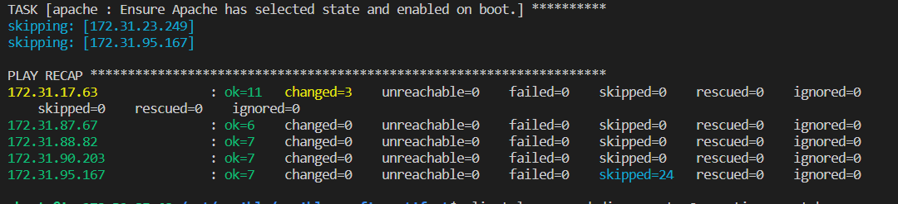
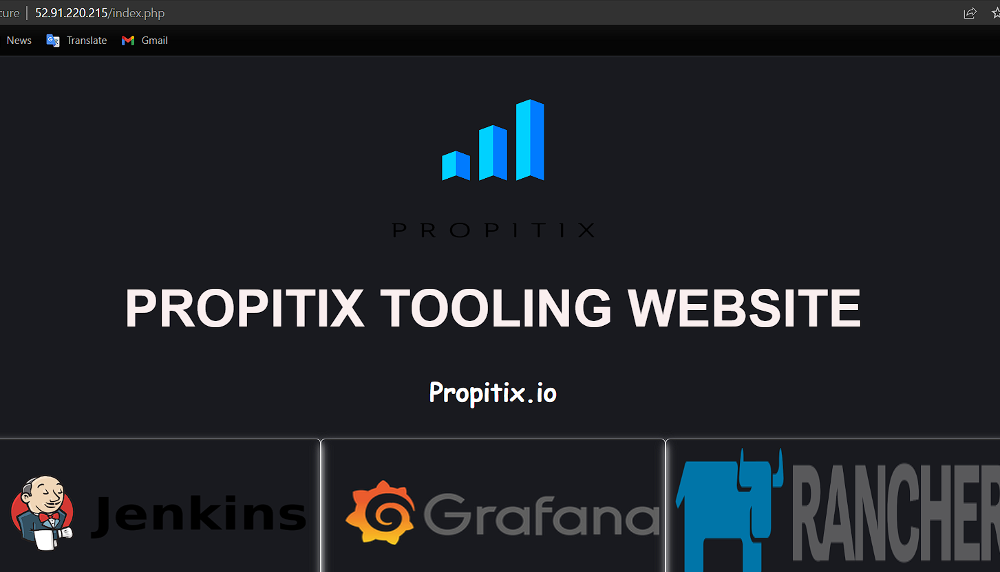

# Project 13 - Ansible Dynamic Assignments (Imports And Community Roles)

**Step 1 - Introduce Dynamic Assignment Into The Existing Structure**
---

- Create a new branch on the local machine and name it `dynamic assignments`.

- Create a new folder called `dynamic-assignments`. This folder will house the dynamic assignments that will be included in the play. Inside the `dynamic-assignments` folder, create a new file and call it `env-vars.yml`.

*`site.yml` will be configured to include the `env-vars.yml` playbook later*

- Ensure that the current folder structure in looks like this.

```
├── dynamic-assignments
│   └── env-vars.yml
├── inventory
│   └── dev
    └── stage
    └── uat
    └── prod
└── playbooks
    └── site.yml
└── roles (optional folder)
    └──...(optional subfolders & files)
└── static-assignments
    └── common.yml
```

- Next step will be to create a folder to store each environment's variable file. Inside these files, instructions will be placed there that can be run against different environments. Name the folder `env-vars`. Ensure the folder structure looks like this.

```
├── dynamic-assignments
│   └── env-vars.yml
├── env-vars
    └── dev.yml
    └── stage.yml
    └── uat.yml
    └── prod.yml
├── inventory
    └── dev
    └── stage
    └── uat
    └── prod
├── playbooks
    └── site.yml
└── static-assignments
    └── common.yml
    └── common-del.yml
    └── uat-webservers.yml
```

- Paste the instruction below into the `env-vars.yml` file.

```
---
- name: collate variables from env specific file, if it exists
  hosts: all
  tasks:
    - name: looping through list of available files
      include_vars: "{{ item }}"
      with_first_found:
        - files:
            - dev.yml
            - stage.yml
            - prod.yml
            - uat.yml
          paths:
            - "{{ playbook_dir }}/../env-vars"
      tags:
        - always
```

*Notice that `include_vars` was used here instead of `include` in the previous project.*

*Note the special variables `{playbook_dir}` and `{item}` used in the above playbook*

*Also note the `with_first_found` loop used here, which uses the first instruction found*

**Step 2 - Update Site.yml With Dynamic Assignments**
---

- Update `site.yml` to make use of the dynamic assignment. Use this below.

```
---
- hosts: all
- name: Include dynamic variables 
  import_playbook: ../static-assignments/common.yml 
  include: ../dynamic-assignments/env-vars.yml
  tags:
    - always

- hosts: webserver
- name: Webserver assignment
  import_playbook: ../static-assignments/uat-webservers.yml
```

**Step 3 - Install MySQL Ansible role**
---

- Run the following codes to initialize the `ansible-config-artifact` folder for Git and push codes to GitHub, eliminating the need for the webhook job in Jenkins.

```
git init
git pull https://github.com/<your-name>/ansible-config-mgt.git
git remote add origin https://github.com/<your-name>/ansible-config-mgt.git
git branch roles-feature
git switch roles-feature
```

- Inside the `roles` directory, create a  new MySQL role using ansible-galaxy and rename the folder so it's easier to identify.

```
ansible-galaxy install geerlingguy.mysql

mv geerlingguy.mysql/ mysql
```

*Go through the `README.md` file of the role to understand the config and make changes where necessary. This is necessary as poorly configured config files will cause problems when the playbook is run & make the websites not be able to reach the database.*

- After the appropriate changes have been made, run the code below to push to GitHub.

```
git add .
git commit -m "Commit new role files into GitHub"
git push --set-upstream origin roles-feature
```

**Step 4 - Set Up Load Balancer Roles**
---

*The goal here is to deploy both Apache and Nginx load balancers for the environment and be able to use either of them on the fly.*

- Install the roles for Nginx and Apache using ansible-galaxy.

- Create a `loadbalancers.yml` file in the `static-assignment` folder to "declare" the load balancer role to render it effective.

- Declare a variable in the `defaults/main.yml` file inside the Nginx and Apache roles. This is the configuration file for both of the roles so all setups must be included here.

  - For the Nginx role, insert these lines.

  ```
  enable_nginx_lb: false
  load_balancer_is_required: false
  ```

  - For the Apache role, insert these lines.

  ```
  enable_apache_lb: false
  load_balancer_is_required: false
  ```

- Also include the webserver IPs that would be load balanced in the `defaults/main.yml` for both Apache and Nginx. More can be added to test. This format can be used `web1: <lbIP>`

- Update both the created `loadbalancers.yml` file and `site.yml` file to reference the roles.

  - For the `loadbalancers.yml` file

  ```
  - hosts: lb
  roles:
    - { role: nginx, when: enable_nginx_lb and load_balancer_is_required }
    - { role: apache, when: enable_apache_lb and load_balancer_is_required }
  ```

  - For the `site.yml` file

  ```
  - hosts: lb
  - name: Loadbalancers assignment
  import_playbook: ../static-assignments/loadbalancers.yml
  when: load_balancer_is_required
  ```

- Ensure the `site.yml` file looks like this below. This contains all the tasks that will be run.

```
---
- hosts: all
- name: Include dynamic variables
  import_playbook: ../static-assignments/common.yml 
  include: ../dynamic-assignments/env-vars.yml
  tags:
    - always

- hosts: all
- name: Delete wireshark
  import_playbook: ../static-assignments/common-del.yml


- hosts: webserver
- name: Webserver assignment
  import_playbook: ../static-assignments/uat-webservers.yml

- hosts: lb
- name: Loadbalancers assignment
  import_playbook: ../static-assignments/loadbalancers.yml
  when: load_balancer_is_required
```

- To activate the load balancer for a particular environment (in this particular case it is UAT), go to the `env-vars` folder and select the environment .yml file to be used. (Mine is `uat.yml`). Since the server list has already been declared in the inventory file for `uat.yml`, the `env-vars/uat.yml` file will define which load balancer to use at a particular time. See below

```
#NGINX LB
enable_nginx_lb: true
load_balancer_is_required: true
```

```
#APACHE LB
enable_apache_lb: true
load_balancer_is_required: true
```

- After setting this up, save and run the playbook against the particular environment. See below for example.

```
ansible-playbook -i inventory/uat.yml playbooks/site.yml 
```



*This code runs the `site.yml` playbook against the `uat` environment.*

- After the play runs successfully, try accessing one of the webservers on a browser using `http://<publicIP>/index.php`.



- After this succeeds, change the load balancer config in the `env-vars/uat.yml` file to use the other load balancer. After this is done, save and run the playbook again.

- After the playbook finishes running, try accessing another webserver from the browser page.


**Project 13 Successfully Deployed!**