# Project 12 - Ansible Refactoring And Static Assignments (Imports And Roles)

**Step 1 - Jenkins Job Enhancement**
---

*Note that the goal in this step is to clean up/optimize the Jenkins build process. Previously, every change will lead to Jenkins creating a new folder for each new build. This would be a problem in the future due to space being consumed on the Jenkins server. This is curtailed in this step as Jenkins woould be configured to keep only 3 of the latest builds and discard the rest, saving much needed space.*

- Create a new folder on the Jenkins server to save all artifacts after each build. This folder will be used to house the artifacts copied from the original `/var/lib/jenkins/` folder.

- Run `mkdir /opt/ansible/ansible-config-artifact` to create the folder and run `sudo chmod -R 777 /opt/ansible/ansible/ansible-config-artifact` to grant Jenkins permission to save files there.

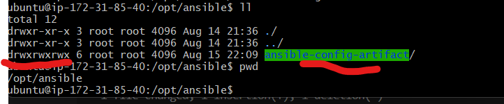

*Opted for creating the folder in `/opt` as creating the folder in `/home/ubuntu/` didn't allow Jenkins access it. See error below:

```
java.nio.file.AccessDeniedException: /home/ubuntu/ansible-config-artifact
```

- Install the `Copy Artifact` Jenkins module and create a new project. I named mine `save artifacts`. Configure the project as below:

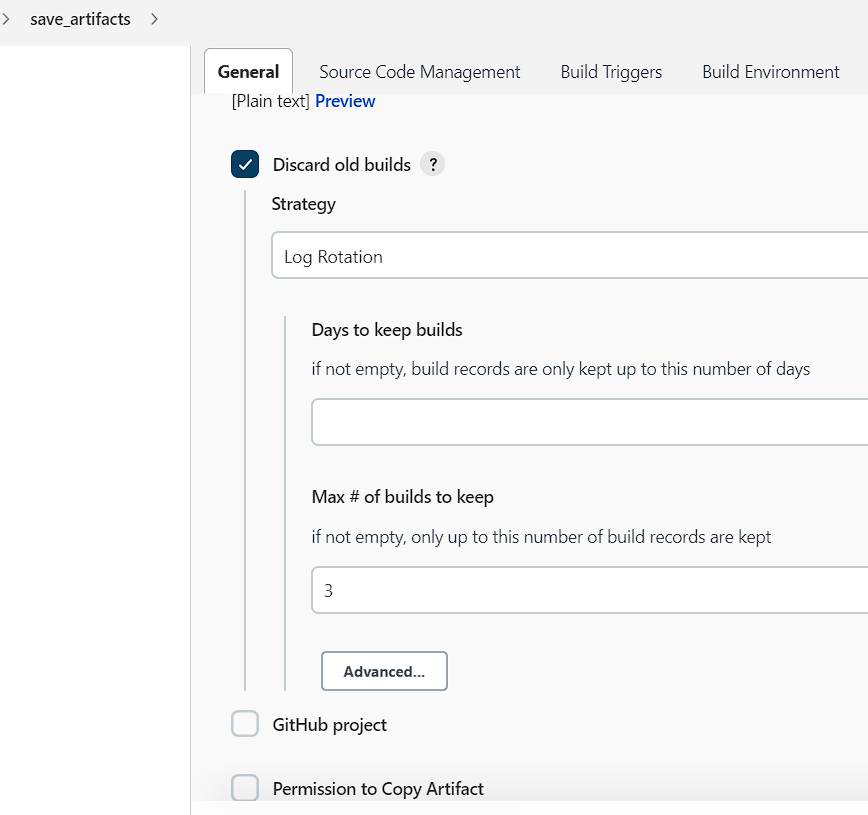

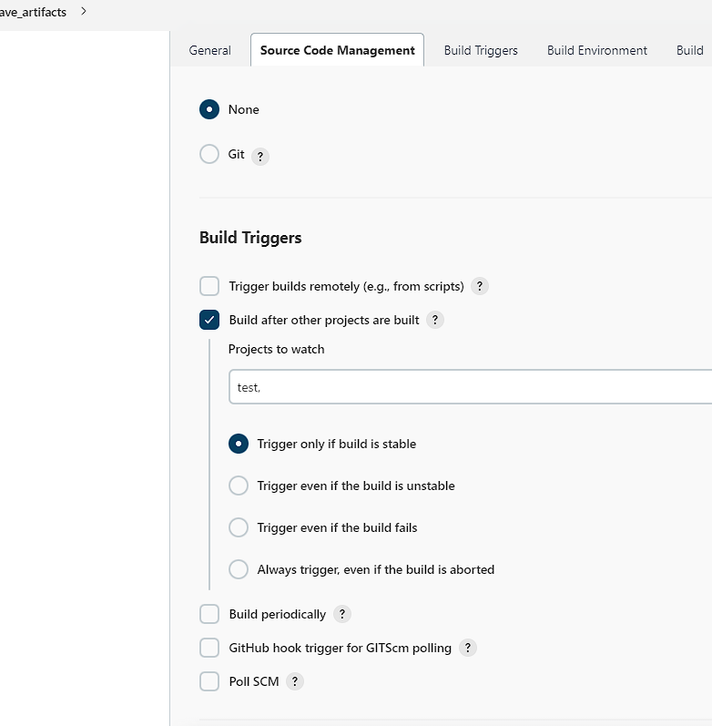

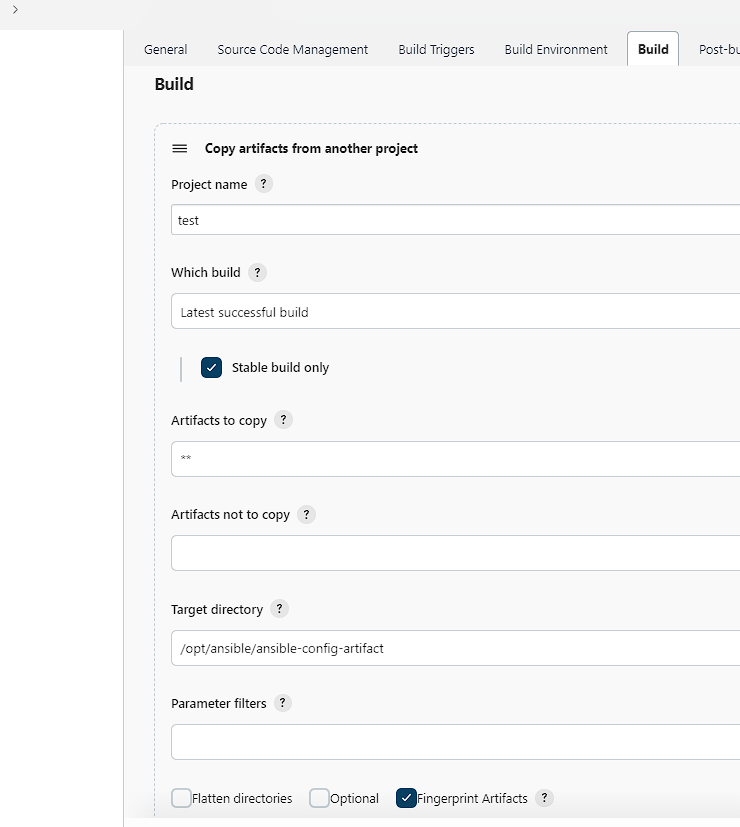

- Save and trigger the `test` job. If successful, the `save_artifacts` job will trigger and copy the files from the `test` job and save in the `/opt/ansible/ansible-config-artifact` folder.

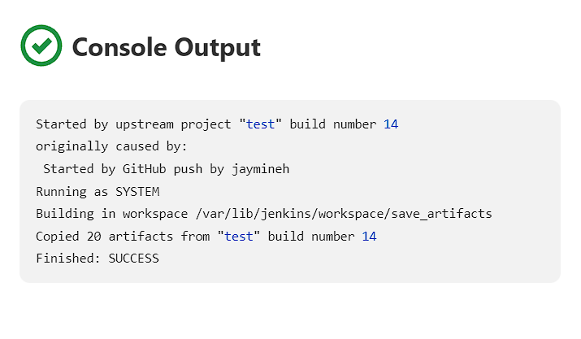

**Step 2 - Refactor Ansible Code By Importing Other Playbooks Into Parent Playbook**
---

*In the previous project, all tasks were done in the `common.yml`, which is OK for simple instructions but is a nightmare for more complex tasks. Here, a playbook will be created that will act as the "parent" or entry point to the entire infrastructure config. Other playbooks will be referenced here. `site.yml` will be used in this case*

- Pull down the latest code that was uploaded in `Step 1` to the local machine and create a new branch called `refactor`.

- Move the previously created `common.yml` playbook into a newly created `static-assignments` folder.

- Inside the `static-asignments` folder, create another playbook called `common-del.yml` reference in the `site.yml` playbook.

- In the previous project, Wireshark was installed using `common.yml`. Here in `common-del.yml`, Wireshark will be removed. Use the below to config the `common-del.yml` file.

```
---
- name: update web & nfs servers
  hosts: webserver, nfs
  remote_user: ec2-user
  become: yes
  become_user: root
  tasks:
    - name: delete wireshark
      yum:
        name: wireshark
        state: removed

- name: update LB & db server
  hosts: lb, db
  remote_user: ubuntu
  become: yes
  become_user: root
  tasks:
    - name: delete wireshark
      apt: 
        name: wireshark-qt
        state: absent
        autoremove: yes
        purge: yes
        autoclean: yes
```

- Inside the `site.yml` file, import the `common-del.yml` playbook. This code uses the built in `import_playbook` module.

```
---
- hosts: all
- import_playbook: ../static-assignments/common-del.yml
```

- Ensure that the folder structure is like this

```
├── static-assignments
│   └── common.yml
├── inventory
    └── dev
    └── stage
    └── uat
    └── prod
└── playbooks
    └── site.yml
```

- Run the ansible playbook against the `dev` servers. Before running the playbook, make sure that ssh-agent was used to ssh into the Jenkins/Ansible server.

```
cd /opt/ansible/ansible-config-artifact/
&
ansible-playbook -i inventory/dev.yml playbooks/site.yml
```

- After the playbook has run successfully, confirm if wireshark was deleted.

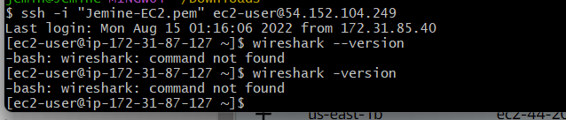

*Over the next steps, 2 new servers will be spun up and configured using the created role for ansible to run the playbook. The end result will be a fully functional tooling website installed on the 2 newly configured UAT webservers*

**Step 3 - Configure UAT Webservers With The "Webserver" Role**
---

- Spin up 2 new RHEL based servers. Remember to modify the NSG to allow incoming traffic.

- Create a directory in the `/opt/ansible/ansible-config-artifact` folder called `roles`. This is where the `webserver` role we will create will reside.

- Create a folder called `webserver` inside the `/opt/ansible/ansible-config-artifact/roles` directory. Ensure that the folder structure looks like this. Doing this "declares" `webserver` as a role.

```
└── roles
  └── webserver
    ├── README.md
    ├── defaults
    │   └── main.yml
    ├── handlers
    │   └── main.yml
    ├── meta
    │   └── main.yml
    ├── tasks
    │   └── main.yml
    └── templates
```

*Alternatively, an ansible utility can be used inside the `/ansible-config-artifact/roles` directory to setup the `webserver` role instead. Inside the `~/.roles` directory, run `ansible-galaxy init webserver` and the role would be setup. However, we went with creating the folder structure manually since we want the code to be stored in GitHub instead of the local machine.*

- Add the IP addresses of the 2 new UAT webservers to the ansible inventory. Go to the `/ansible-config-artifact/inventory/uat.yml` file and insert the config below.

```
[uat-webservers]
<Web1-UAT-Server-Private-IP-Address> ansible_ssh_user='ec2-user' 

<Web2-UAT-Server-Private-IP-Address> ansible_ssh_user='ec2-user' 
```
- Go to the global ansible config file in `/etc/ansible/ansible.cfg` and insert the following line below. Doing this allows ansible to know where to find configured roles. If the config file does not exist, create the directory and the cfg file.

```
[defaults]
roles_path = /opt/ansible/ansible-config-artifact/roles
```

- Go to the `tasks` directory and edit the `main.yml` file to add tasks to be done referencing the `webserver` role. The tasks include: installing and configuring apache (httpd), cloning the tooling website from github, ensuring the website code is deployed to `/var/www/html` on both UAT webservers and ensuring httpd is started. See config below.

```
---
- name: install apache
  become: true
  ansible.builtin.yum:
    name: "httpd"
    state: present

- name: install git
  become: true
  ansible.builtin.yum:
    name: "git"
    state: present

- name: clone a repo
  become: true
  ansible.builtin.git:
    repo: https://github.com/<your-name>/tooling.git
    dest: /var/www/html
    force: yes

- name: copy html content to one level up
  become: true
  command: cp -r /var/www/html/html/ /var/www/

- name: Start service httpd, if not started
  become: true
  ansible.builtin.service:
    name: httpd
    state: started

- name: recursively remove /var/www/html/html/ directory
  become: true
  ansible.builtin.file:
    path: /var/www/html/html
    state: absent
```

**Step 4 - Reference "Webserver" Role**
---

- Within the `static-assignments` folder, create a new file called `uat-webservers.yml`, where the webserver role will be referenced. See config below.

```
---
- hosts: uat-webservers
  roles:
     - webserver
```

- Remember that the "parent" config file is `site.yml` so the `uat-webservers.yml` file must be referenced in it. Go to the `site.yml` and setup as below.

```
---
- hosts: all
- import_playbook: ../static-assignments/common.yml

- hosts: uat-webservers
- import_playbook: ../static-assignments/uat-webservers.yml
```

*Note that `common-del.yml` has been changed back to `common.yml` since wireshark had been deleted earlier and would need to be installed again.

**Step 5 - Commit & Test**
---

- Save, commit and push the changes to the `refactor` branch. Create a pull request to merge to the `master` branch. Confirm that both Jenkins jobs ran and the files were all copied into the `opt/ansible/ansible-config-artifact/` directory.

  -I noticed I was getting a permission error on the `save_artifacts` project. I had used the `ansible-galaxy` module to create the `webserver` role and didn't realize the `/roles` folder ownership was set to `ubuntu` so Jenkins couldn't access it.
  
  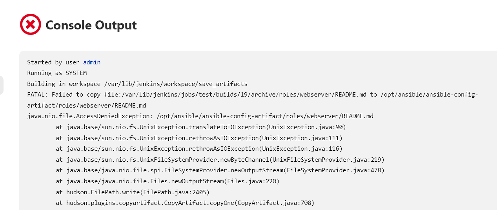
  
  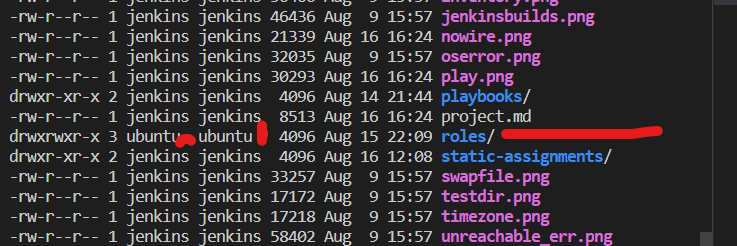

  - I resolved the issue by changing ownership of the `/roles` folder to jenkins by running `sudo chown -R jenkins:jenkins roles/` and restarting Jenkins by `sudo service jenkins restart`. After doing this, the build worked.

  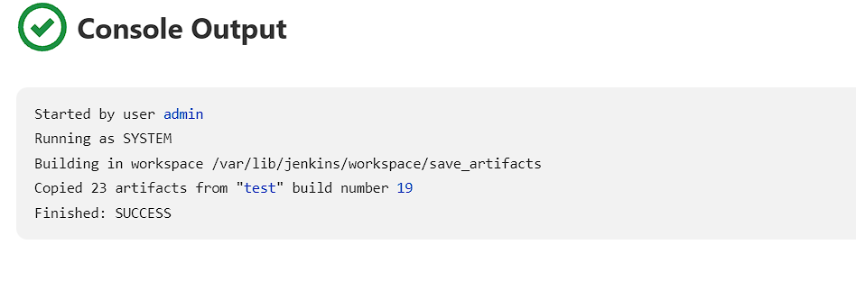

- Run the playbook against the `uat` inventory with the `site.yml` playbook.

```
cd /opt/ansible/ansible-config-artifact/

ansible-playbook -i inventory/uat.yml playbooks/site.yml
```

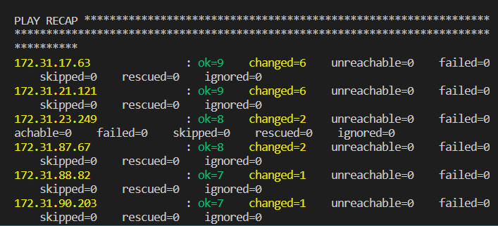

- Confirm that UAT webservers can be reached from the browser. Go to `http://<Web1-UAT-Server-Public-IP-or-Public-DNS-Name>/index.php`. See result below.

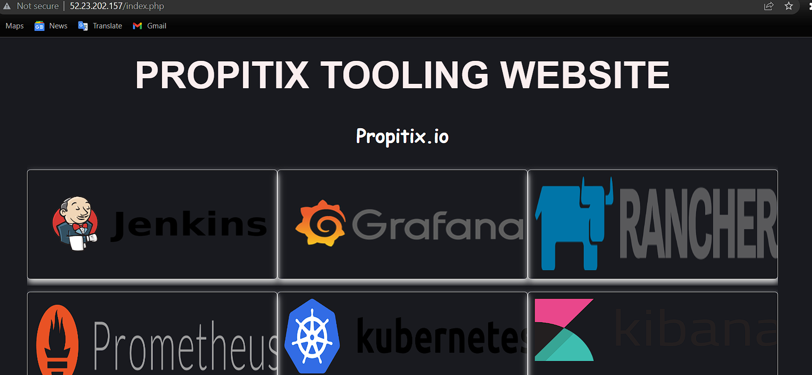

**Project 12 Deployed Successfully!**